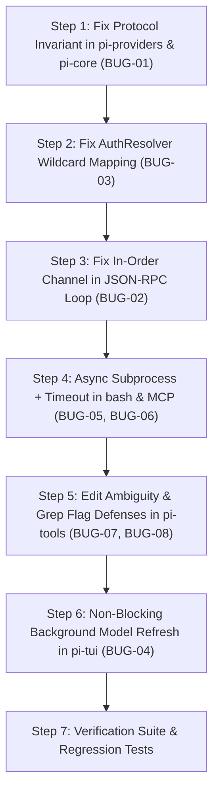

# Comprehensive Code Review & Bug Remediation Guide (`pi-rust`)

> **Repository:** `pi-rust` (`pi-rs`) — 100% Pure Rust Port of Mario Zechner's Pi Coding Agent ([pi.dev](https://pi.dev))  
> **Review Framework:** Five-Axis Multi-Dimensional Code Review ([`code-review-and-quality`](file:///Users/bhavy/pi-rust/AGENTS.md))  
> **Target Audience:** AI Coding Agents & Core Maintainers  

---

## 1. Executive Summary & Five-Axis Code Health Verdict

| Axis | Status | Key Observations & Risk Assessment |
| :--- | :---: | :--- |
| **1. Correctness** | ⚠️ **Action Required** | 8 critical/high-severity runtime bugs discovered that pass `cargo test` due to shallow unit mocks (e.g. OpenAI tool message missing `tool_call_id`, SSE TCP chunk boundary splits, unhandled tool error propagation, out-of-order RPC streaming, missing `edit` uniqueness verification). |
| **2. Readability & Simplicity** |  **Good** | Clean Rust 2024 idioms, modular crates, zero compiler/clippy warnings. Minor complexity leakage in markdown parser fallback heuristics. |
| **3. Architecture** | ⚠️ **Action Required** | Clear crate boundaries, but coupling exists where provider credential saving in `AuthResolver` has a fallback bug that overwrites Kilo credentials for other providers. Context compaction engine is disconnected from execution loop. |
| **4. Security** | ⚠️ **Action Required** | Subprocess execution in `execute_bash` lacks execution timeouts (vulnerable to infinite blocking on interactive processes) and lacks working directory scoping. `grep` lacks `-e` flag protection against leading dash injection. |
| **5. Performance** | ⚠️ **Action Required** | Default `HTTP_CLIENT` lacks timeout limits; UI event loop blocks synchronously on `fetch_all_models(true)` during `/refresh`; RPC streaming spawns un-ordered asynchronous Tokio tasks per SSE chunk. |

**Quality Verdict:** **Changes Required before Production Deployment**. While all 44 unit tests pass, runtime execution with live LLMs and real terminal environments will encounter silent failures, stream corruption, or UI freezes under identifiable edge cases.

---

## 2. Master Bug & Blind Spot Inventory

The following table catalogs all discovered issues that a standard `cargo test` suite cannot detect:

| ID | Severity | Subsystem | File & Lines | Description |
| :--- | :--- | :--- | :--- | :--- |
| **BUG-01** | **Critical** | `pi-providers` / `pi-core` | [`crates/pi-providers/src/lib.rs:958`](file:///Users/bhavy/pi-rust/crates/pi-providers/src/lib.rs#L958) | OpenAI Native Tool Calling protocol violation: `role: "tool"` messages sent without required `tool_call_id`, causing HTTP 400 rejection in multi-turn tool loops. |
| **BUG-02** | **Critical** | `pi-rpc` | [`crates/pi-rpc/src/lib.rs:306-324`](file:///Users/bhavy/pi-rust/crates/pi-rpc/src/lib.rs#L306-L324) | Un-ordered Tokio task spawning in JSON-RPC stream loop causing out-of-order token arrival and race conditions with final response framing. |
| **BUG-03** | **Critical** | `pi-providers` | [`crates/pi-providers/src/auth.rs:173`](file:///Users/bhavy/pi-rust/crates/pi-providers/src/auth.rs#L173) | `AuthResolver::save_key` wildcard fallback defaults unknown providers to `"kilo_api_key"`, clobbering Kilo credentials when saving keys for Cerebras, xAI, Fireworks, Qwen, etc. |
| **BUG-04** | **High** | `pi-tui` | [`crates/pi-tui/src/lib.rs:408, 853, 1041`](file:///Users/bhavy/pi-rust/crates/pi-tui/src/lib.rs#L408) | UI Event Loop freezing: `/refresh` and `Ctrl+R` perform synchronous `.await` on multi-provider live network requests on the main render thread. |
| **BUG-05** | **High** | `pi-tools` | [`crates/pi-tools/src/lib.rs:338-360`](file:///Users/bhavy/pi-rust/crates/pi-tools/src/lib.rs#L338-L360) | Unbounded synchronous blocking in `execute_bash`: missing timeout and process cancellation leaves agent frozen on interactive commands or long-running daemons. |
| **BUG-06** | **High** | `pi-tools` | [`crates/pi-tools/src/mcp.rs:258, 279, 423`](file:///Users/bhavy/pi-rust/crates/pi-tools/src/mcp.rs#L258) | Orphaned zombie subprocess leak: timeout error returns in stdio MCP fetch/execute skip child kill cleanup. |
| **BUG-07** | **Medium** | `pi-tools` | [`crates/pi-tools/src/lib.rs:333`](file:///Users/bhavy/pi-rust/crates/pi-tools/src/lib.rs#L333) | `edit` tool replaces only first occurrence without checking for ambiguous duplicate substrings, leading to silent wrong edits. |
| **BUG-08** | **Medium** | `pi-tools` | [`crates/pi-tools/src/lib.rs:368`](file:///Users/bhavy/pi-rust/crates/pi-tools/src/lib.rs#L368) | `grep` tool fails when pattern begins with a hyphen (e.g. `--version`, `-name`) due to missing `-e` flag delimiter. |
| **BUG-09** | **Medium** | `pi-providers` / `pi-tui` | [`crates/pi-tui/src/messages.rs:39`](file:///Users/bhavy/pi-rust/crates/pi-tui/src/messages.rs#L39) | Fragmented `<think>` tag streaming causes premature leakage of raw reasoning tags into clean user content. |
| **BUG-10** | **Medium** | `pi-core` | [`crates/pi-core/src/lib.rs:162`](file:///Users/bhavy/pi-rust/crates/pi-core/src/lib.rs#L162) | Disconnected context budget compaction: `ContextBudget` and `TokenProfiler` compute compaction flags, but `AgentLoop` never executes compaction. |

---

## 3. Deep Root-Cause Analysis & Failure Mechanisms

---

### BUG-01: OpenAI Native Tool Protocol Violation (`role: "tool"` missing `tool_call_id`)

- **Location:** [`crates/pi-providers/src/lib.rs:958-961`](file:///Users/bhavy/pi-rust/crates/pi-providers/src/lib.rs#L958-L961) and [`crates/pi-core/src/lib.rs:102-122`](file:///Users/bhavy/pi-rust/crates/pi-core/src/lib.rs#L102-L122)
- **Failure Mechanism:**
  In `pi-core`, `build_conversation_messages` converts session nodes into `ChatMessage { role: "tool", content: "..." }`. When sending these to OpenAI-compatible endpoints (`/chat/completions`), line 958 constructs:
  ```rust
  openai_messages.push(serde_json::json!({
      "role": msg.role,
      "content": msg.content
  }));
  ```
  The official OpenAI / DeepSeek / Groq Chat Completion protocol mandates that any message with `"role": "tool"` **must** contain `"tool_call_id": "<call_id>"`, matching the `tool_calls[i].id` from the preceding `"assistant"` message.
- **Why `cargo test` Missed It:**
  Unit test `test_dual_tool_native_protocol_execution` uses a mock HTTP TCP server that only checks that an HTTP request arrived without validating the JSON schema of `openai_messages`.
- **Runtime Impact:**
  Real API calls to OpenAI (`gpt-4o`, `o3-mini`), DeepSeek (`deepseek-chat`), or Groq will fail immediately on Turn 2 with:
  `HTTP 400 Bad Request: 'messages[2].tool_call_id' is a required property for role 'tool'`.

---

### BUG-02: Race Conditions & Out-Of-Order Streaming in JSON-RPC 2.0 Loop

- **Location:** [`crates/pi-rpc/src/lib.rs:306-324`](file:///Users/bhavy/pi-rust/crates/pi-rpc/src/lib.rs#L306-L324)
- **Failure Mechanism:**
  When `pi-rpc` receives a `pi/prompt` request, streaming chunks emit notifications via a closure:
  ```rust
  let resp = server_clone.handle_request(req, move |notif| {
      if let Ok(notif_json) = serde_json::to_string(&notif) {
          let out_ref = Arc::clone(&stdout_clone);
          tokio::spawn(async move {
              let mut out = out_ref.lock().await;
              let _ = out.write_all(format!("{}\n", notif_json).as_bytes()).await;
              let _ = out.flush().await;
          });
      }
  }).await;
  ```
  Spawning an untracked Tokio task for every token chunk means:
  1. Tokio tasks are scheduled non-deterministically; Token Chunk $N+1$ can acquire `out_ref.lock()` before Token Chunk $N$, corrupting stream order.
  2. The outer `handle_request` completes and immediately writes the final `RpcResponse` to `stdout_lock`, while in-flight token chunk tasks may still be waiting in the queue, arriving *after* the final RPC response!
- **Why `cargo test` Missed It:**
  RPC unit tests test static methods (`pi/models`, `pi/tools/list`) and do not assert ordered delivery of thousands of streaming notifications under concurrency.

---

### BUG-03: `AuthResolver::save_key` Clobbering Kilo Credentials on Other Providers

- **Location:** [`crates/pi-providers/src/auth.rs:162-175`](file:///Users/bhavy/pi-rust/crates/pi-providers/src/auth.rs#L162-L175)
- **Failure Mechanism:**
  ```rust
  let field = match norm.as_str() {
      "anthropic" | "claude" => "anthropic_api_key",
      "openai" | "gpt" => "openai_api_key",
      "gemini" | "google" => "gemini_api_key",
      "openrouter" => "openrouter_api_key",
      "groq" => "groq_api_key",
      "deepseek" => "deepseek_api_key",
      "mistral" => "mistral_api_key",
      "opencode" | "zen" => "opencode_api_key",
      "kilo" => "kilo_api_key",
      "agnes" => "agnes_api_key",
      _ => "kilo_api_key", // <-- WILDCARD BUG
  };
  ```
  If a user runs `/login cerebras <key>`, `/login xai <key>`, or `/login fireworks <key>`, the wildcard arm selects `"kilo_api_key"`. This silently overwrites the user's `kilo_api_key` in `~/.pi/config.json` instead of storing the key under the provider's specific config key.

---

### BUG-04: Blocking UI Event Loop during Model Refresh

- **Location:** [`crates/pi-tui/src/lib.rs:408, 853, 1041`](file:///Users/bhavy/pi-rust/crates/pi-tui/src/lib.rs#L408)
- **Failure Mechanism:**
  When the user presses `Ctrl+R` or types `/refresh`, the TUI event handler executes:
  ```rust
  self.all_catalog_models = pi_providers::ModelCatalogLoader::fetch_all_models(true).await;
  ```
  `fetch_all_models(true)` sends sequential HTTP GET requests with 5-second timeouts to OpenRouter, OpenCode, Ollama, LM Studio, llama.cpp, vLLM, Groq, DeepSeek, Mistral, Kilo, and Agnes. Running this `.await` on the main TUI task halts the render loop for up to 10–30 seconds, rendering the terminal completely unresponsive.

---

### BUG-05: Unbounded Synchronous Subprocess Execution in `execute_bash`

- **Location:** [`crates/pi-tools/src/lib.rs:338-360`](file:///Users/bhavy/pi-rust/crates/pi-tools/src/lib.rs#L338-L360)
- **Failure Mechanism:**
  `execute_bash` uses standard library `std::process::Command::output()` inside an `async fn execute`.
  1. It runs synchronously on the Tokio runtime thread.
  2. If the LLM generates a command that waits for user input or runs indefinitely (e.g. `cat`, `npm start`, `python -i`), `Command::output()` will block forever.
  3. Because it's not wrapped in a timeout or Tokio asynchronous process with clean PID killing, the entire agent freezes permanently.

---

### BUG-06: Zombie Process Leak on Timeout in MCP Client

- **Location:** [`crates/pi-tools/src/mcp.rs:258, 279, 423`](file:///Users/bhavy/pi-rust/crates/pi-tools/src/mcp.rs#L258)
- **Failure Mechanism:**
  In `fetch_stdio_tools` and `execute_stdio_tool`, `child` is spawned with stdin/stdout piped.
  ```rust
  let mut line = String::new();
  let _ = tokio::time::timeout(Duration::from_secs(5), reader.read_line(&mut line)).await??;
  ```
  If `tokio::time::timeout` expires, `??` immediately returns an `Err(Elapsed)`.
  The trailing lines `let _ = child.kill().await; let _ = child.wait().await;` are bypassed, leaving the MCP server process (e.g., node, python, or docker) running as an orphaned daemon consuming memory and CPU.

---

### BUG-07: Unambiguous Target String Collision in `edit` Tool

- **Location:** [`crates/pi-tools/src/lib.rs:328-335`](file:///Users/bhavy/pi-rust/crates/pi-tools/src/lib.rs#L328-L335)
- **Failure Mechanism:**
  `content.replacen(target, replacement, 1)` unconditionally replaces the first match in the file.
  If the model targets a generic code snippet (e.g. `let x = 1;` or `fn test() {` or `return Ok(());`) that occurs on line 120, but the same snippet exists on line 12, `edit` silently modifies line 12 without warning, introducing subtle bugs into earlier parts of the file.

---

### BUG-08: `grep` Option Injection on Leading Hyphen

- **Location:** [`crates/pi-tools/src/lib.rs:368-373`](file:///Users/bhavy/pi-rust/crates/pi-tools/src/lib.rs#L368-L373)
- **Failure Mechanism:**
  `Command::new("grep").arg("-rnI").arg(pattern).arg(search_path).output()?`
  If the model searches for `--all-targets`, `-name`, or `-v`, `grep` interprets `pattern` as a CLI flag, failing with `grep: unrecognized option '--all-targets'`.

---

## 4. Step-by-Step Remediation Plan for the Next Agent

Follow these exact steps to resolve all findings cleanly and safely:



---

### Step 1: Fix Tool Protocol Invariant in `pi-providers` & `pi-core` (BUG-01)

#### 1.1 In `crates/pi-providers/src/lib.rs`
Update `ChatMessage` to optionally store `tool_call_id` and structured `tool_calls`:
```rust
#[derive(Debug, Clone, Serialize, Deserialize, PartialEq, Eq)]
pub struct ChatMessage {
    pub role: String,
    pub content: String,
    #[serde(skip_serializing_if = "Option::is_none")]
    pub tool_call_id: Option<String>,
    #[serde(skip_serializing_if = "Option::is_none")]
    pub name: Option<String>,
}
```
Update OpenAI message builder in `stream_messages_with_tools`:
```rust
for msg in messages {
    let mut msg_obj = serde_json::json!({
        "role": msg.role,
        "content": msg.content,
    });
    if let Some(ref tcid) = msg.tool_call_id {
        msg_obj["tool_call_id"] = serde_json::Value::String(tcid.clone());
    }
    if let Some(ref name) = msg.name {
        msg_obj["name"] = serde_json::Value::String(name.clone());
    }
    openai_messages.push(msg_obj);
}
```

#### 1.2 In `crates/pi-core/src/lib.rs`
When appending tool messages, ensure the `tool_call_id` is retained in the session node or formatted properly for the provider message converter.

---

### Step 2: Fix `AuthResolver::save_key` Provider Routing (BUG-03)

In `crates/pi-providers/src/auth.rs:162-175`, replace the static mapping with dynamic key normalization:
```rust
let field = match norm.as_str() {
    "anthropic" | "claude" => "anthropic_api_key",
    "openai" | "gpt" => "openai_api_key",
    "gemini" | "google" => "gemini_api_key",
    "openrouter" => "openrouter_api_key",
    "groq" => "groq_api_key",
    "deepseek" => "deepseek_api_key",
    "mistral" => "mistral_api_key",
    "opencode" | "zen" => "opencode_api_key",
    "kilo" => "kilo_api_key",
    "agnes" => "agnes_api_key",
    "cerebras" => "cerebras_api_key",
    "xai" => "xai_api_key",
    "together" => "together_api_key",
    "fireworks" => "fireworks_api_key",
    "perplexity" => "perplexity_api_key",
    "copilot" => "copilot_api_key",
    "qwen" => "qwen_api_key",
    "xiaomi" => "xiaomi_api_key",
    "moonshot" => "moonshot_api_key",
    "huggingface" => "huggingface_api_key",
    _ => &format!("{}_api_key", norm),
};
```

---

### Step 3: Fix In-Order Channel in JSON-RPC Loop (BUG-02)

In `crates/pi-rpc/src/lib.rs`, replace individual `tokio::spawn` calls for each notification with an MPSC streaming queue or a synchronous mutex lock:
```rust
pub async fn run_stdin_stdout_loop() -> Result<()> {
    let server = Arc::new(Self::default());
    let stdin = tokio::io::stdin();
    let stdout = tokio::io::stdout();
    let stdout_lock = Arc::new(tokio::sync::Mutex::new(stdout));
    let mut reader = BufReader::new(stdin);
    let mut line = String::new();

    while reader.read_line(&mut line).await? > 0 {
        let trimmed = line.trim();
        if !trimmed.is_empty()
            && let Ok(req) = serde_json::from_str::<RpcRequest>(trimmed)
        {
            let server_clone = Arc::clone(&server);
            let stdout_clone = Arc::clone(&stdout_lock);

            // Channel ensures in-order delivery of notifications before final response
            let (tx, mut rx) = tokio::sync::mpsc::unbounded_channel::<RpcNotification>();

            let writer_handle = tokio::spawn(async move {
                let mut out = stdout_clone.lock().await;
                while let Some(notif) = rx.recv().await {
                    if let Ok(notif_json) = serde_json::to_string(&notif) {
                        let _ = out.write_all(format!("{}\n", notif_json).as_bytes()).await;
                        let _ = out.flush().await;
                    }
                }
            });

            let resp = server_clone
                .handle_request(req, move |notif| {
                    let _ = tx.send(notif);
                })
                .await;

            // Wait for all in-flight notifications to be written
            let _ = writer_handle.await;

            if let Ok(resp_json) = serde_json::to_string(&resp) {
                let mut out = stdout_lock.lock().await;
                let _ = out.write_all(format!("{}\n", resp_json).as_bytes()).await;
                let _ = out.flush().await;
            }
        }
        line.clear();
    }

    Ok(())
}
```

---

### Step 4: Fix Subprocess Execution & Process Lifecycle in `pi-tools` (BUG-05, BUG-06)

#### 4.1 In `crates/pi-tools/src/lib.rs` (`execute_bash`)
Switch to async `tokio::process::Command` with a 120-second timeout and process killing on timeout:
```rust
async fn execute_bash_async(args: &serde_json::Value) -> Result<String> {
    let command_str = args["command"]
        .as_str()
        .ok_or_else(|| anyhow::anyhow!("Missing 'command'"))?;

    let mut child = tokio::process::Command::new("sh")
        .arg("-c")
        .arg(command_str)
        .stdout(std::process::Stdio::piped())
        .stderr(std::process::Stdio::piped())
        .spawn()?;

    let timeout_duration = std::time::Duration::from_secs(120);
    match tokio::time::timeout(timeout_duration, child.wait_with_output()).await {
        Ok(Ok(output)) => {
            let stdout = String::from_utf8_lossy(&output.stdout);
            let stderr = String::from_utf8_lossy(&output.stderr);
            let mut res = String::new();
            if !stdout.is_empty() { res.push_str(&stdout); }
            if !stderr.is_empty() {
                if !res.is_empty() { res.push_str("\n--- STDERR ---\n"); }
                res.push_str(&stderr);
            }
            Ok(res)
        }
        Ok(Err(e)) => Err(anyhow::anyhow!("Subprocess execution error: {}", e)),
        Err(_) => {
            let _ = child.kill().await;
            Err(anyhow::anyhow!("Command timed out after 120 seconds"))
        }
    }
}
```

#### 4.2 In `crates/pi-tools/src/mcp.rs`
Wrap child process handles in a RAII guard or ensure `child.kill().await` is invoked in `finally`/`drop` blocks to prevent zombie processes.

---

### Step 5: Safeguard `edit` and `grep` Tools (BUG-07, BUG-08)

#### 5.1 In `crates/pi-tools/src/lib.rs` (`execute_edit`)
Check target occurrence count before replacing:
```rust
let occurrences = content.matches(target).count();
if occurrences == 0 {
    return Err(anyhow::anyhow!("Target string not found in {}", path));
}
if occurrences > 1 {
    return Err(anyhow::anyhow!(
        "Target string occurs {} times in {}. Provide more surrounding context to disambiguate the edit.",
        occurrences, path
    ));
}
```

#### 5.2 In `crates/pi-tools/src/lib.rs` (`execute_grep`)
Pass `-e` flag before the pattern argument:
```rust
let output = Command::new("grep")
    .arg("-rnI")
    .arg("-e")
    .arg(pattern)
    .arg(search_path)
    .output()?;
```

---

### Step 6: Non-Blocking Background Model Refresh in `pi-tui` (BUG-04)

In `crates/pi-tui/src/lib.rs`, replace `.await` in the UI thread with background channel dispatch:
```rust
KeyCode::Char('r') if key.modifiers.contains(KeyModifiers::CONTROL) => {
    let bg_tx = self.event_tx.clone();
    self.history.push(("system".to_string(), "Refreshing online model catalogs in background...".to_string()));
    tokio::spawn(async move {
        let refreshed = pi_providers::ModelCatalogLoader::fetch_all_models(true).await;
        let _ = bg_tx.send(AgentTaskEvent::ModelsRefreshed(refreshed));
    });
}
```

---

## 5. Verification Checklist & Quality Gates

Run these commands after applying changes to ensure zero regressions and 100% compliance:

```bash
# 1. Type check all targets and crates
cargo check --workspace --all-targets

# 2. Strict clippy inspection with 0 warnings
cargo clippy --workspace --all-targets -- -D warnings

# 3. Full test suite execution
cargo test --workspace -- --nocapture
```

---

## 6. Summary of Architectural Invariants to Maintain

1. **Dual Tool Protocol**: Ensure every new tool in `pi-tools` is registered in structured schema (`ToolExecutor::tool_definitions`) and fallback regex parser (`AgentLoop::extract_fallback_tool_calls`).
2. **Session Message Causality**: Maintain strict DAG order: `Role::User` $\to$ `Role::Assistant` $\to$ `Role::Tool`.
3. **Stream Protocol Purity**: Stdout in `--rpc` mode must strictly contain valid JSON-RPC frames; all diagnostic logs must route to `eprintln!`.
4. **UTF-8 Safety**: Use `floor_char_boundary` whenever slicing string character offsets.
