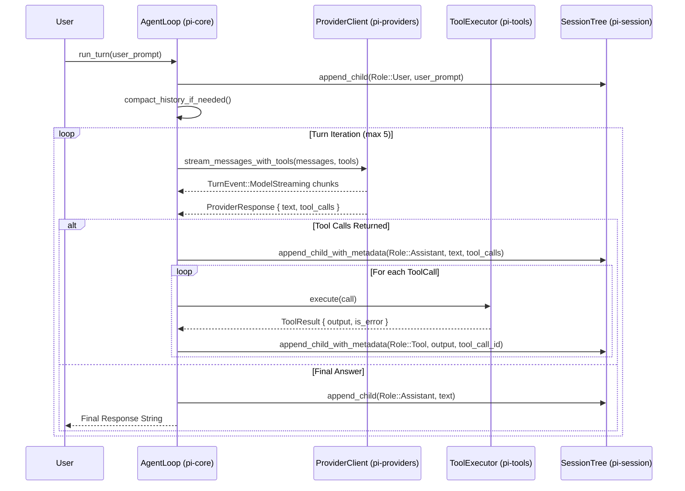
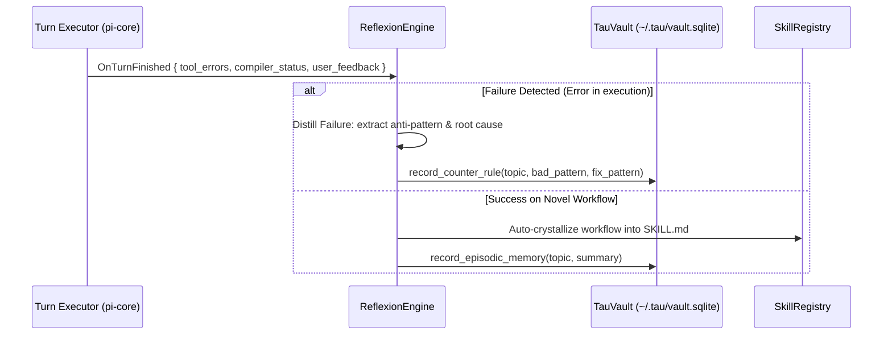

> **Project**: `pi-rust` / `tau` (`τ`) — Pure Rust Autonomous Coding Agent
# SPEC.md — System Architecture & Protocol Specification

> **Project**: `pi-rust` / `tau` (`τ`) — Universal Self-Improving Autonomous Agent Harness & AI Operating Layer  
> **Core Motto**: *"100% Pure Rust — Zero Runtime Bloat, Zero Node.js, Maximum Velocity, Continuous Self-Evolution."*  
> **Design Principle**: *"Set the floor, not the ceiling."*  

---

## 1. System Architecture & Crate Graph

`tau` is compiled as a self-contained Cargo workspace containing 7 focused crates. Leaf crates remain completely decoupled from orchestrator crates.

```
                                +-----------------------------------+
                                |              pi-cli               |
                                |   (Entry Binary & Dispatcher)     |
                                +-----------------+-----------------+
                                                  |
         +----------------------------------------+----------------------------------------+
         |                                        |                                        |
         v                                        v                                        v
+----------------+                       +----------------+                       +----------------+
|     pi-tui     |                       |    pi-core     |                       |     pi-rpc     |
| (Ratatui, TUI) |                       | (Agent Engine) |                       |  (JSON-RPC 2.0)|
+-------+--------+                       +---+---+----+---+                       +--------+-------+
        |                                    |   |    |                                    |
        +------------------+-----------------+   |    +------------------+-----------------+
                           |                     |                       |
                           v                     |                       v
                  +-----------------+            |              +-----------------+
                  |  pi-providers   |            |              |   pi-session    |
                  |  (Multi-LLM)    |            |              | (DAG Graph &    |
                  +-----------------+            |              |  JSONL Engine)  |
                                                 |              +-----------------+
                                                 v
                                        +-----------------+
                                        |    pi-tools     |
                                        | (Native Tools & |
                                        |  MCP Discovery) |
                                        +-----------------+
```

### Dependency Invariants
1. `pi-cli` depends on `pi-core`, `pi-providers`, `pi-session`, `pi-tools`, `pi-tui`, `pi-rpc`.
2. `pi-tui` depends on `pi-core`, `pi-providers`, `pi-session`.
3. `pi-rpc` depends on `pi-core`, `pi-providers`, `pi-session`, `pi-tools`.
4. `pi-core` depends on `pi-providers`, `pi-session`, `pi-tools`.
5. Leaf crates (`pi-providers`, `pi-session`, `pi-tools`) must remain completely decoupled from one another.

---

## 2. Upstream Pi Parity Specification

| Upstream TypeScript Package (`earendil-works/pi`) | Rust Crate (`pi-rust`) | Implementation Model & Specification |
| :--- | :--- | :--- |
| **`@earendil-works/pi-agent-core`** (`packages/agent`) | [`crates/pi-session`](file:///Users/bhavy/pi-rust/crates/pi-session) & [`crates/pi-core`](file:///Users/bhavy/pi-rust/crates/pi-core) | Directed Acyclic Graph (DAG) session tree, active branch pointer, non-destructive rewinding, and fork points. |
| **`@earendil-works/pi-ai`** (`packages/ai`) | [`crates/pi-providers`](file:///Users/bhavy/pi-rust/crates/pi-providers) | Unified multi-gateway client (Anthropic Messages API, OpenAI Chat Completions, Ollama, Kilo, OpenCode, Agnes), SSE streaming decoders, TokenProfiler, ContextBudget, AuthResolver. |
| **`@earendil-works/pi-coding-agent`** (`packages/coding-agent`) | [`crates/pi-core`](file:///Users/bhavy/pi-rust/crates/pi-core) & [`crates/pi-tools`](file:///Users/bhavy/pi-rust/crates/pi-tools) | Coding system prompt envelope, `AGENTS.md` autodiscovery, Dual Tool protocol, automated context compaction loop, built-in engineering tools (`read`, `write`, `edit`, `bash`, `grep`, `find`, `ls`, `web_fetch`, `web_search`, `git`, `github`, `lsp`, `ast`). |
| **`@earendil-works/pi-tui`** (`packages/tui`) | [`crates/pi-tui`](file:///Users/bhavy/pi-rust/crates/pi-tui) | Ratatui terminal UI, 6-stop gradient ASCII TAU header, 2-line status bar, interactive overlays (Model Picker, Provider Picker, Session Tree, Auth Wizard), Mermaid ASCII/Unicode renderer, syntax-highlighted code blocks. |
| **`@earendil-works/pi-protocol`** & **`pi-server`** | [`crates/pi-rpc`](file:///Users/bhavy/pi-rust/crates/pi-rpc) | Bi-directional JSON-RPC 2.0 engine over standard I/O with ordered MPSC notification streaming (`pi/streamingChunk`, `pi/toolExecuting`, `pi/toolCompleted`). |
| **`session-backends/sqlite-node`** | [`crates/pi-session`](file:///Users/bhavy/pi-rust/crates/pi-session) | Append-only streaming `.jsonl` disk persistence matching `~/.pi/agent/sessions/--<encoded_cwd>--/<session_id>.jsonl`. |

---

## 3. Session Tree DAG & Persistence Specification

### Node Data Structure & Metadata
```rust
#[derive(Debug, Clone, Serialize, Deserialize)]
pub struct SessionNode {
    pub id: String,
    pub parent_id: Option<String>,
    pub children_ids: Vec<String>,
    pub role: Role,
    pub content: String,
    pub timestamp: String,
    pub tool_call_id: Option<String>,
    pub tool_name: Option<String>,
    pub tool_calls: Option<serde_json::Value>,
}
```

### Disk Format (`.jsonl`)
Sessions are persisted in append-only JSONL files located at:
`~/.pi/agent/sessions/--<encoded_cwd>--/<session_id>.jsonl`

**Line 1 (Session Header):**
```json
{"type":"session","version":3,"id":"<session_uuid>","timestamp":"2026-08-15T12:00:00Z","cwd":"/path/to/project"}
```

**Subsequent Lines (Messages):**
```json
{"type":"message","id":"a1b2c3d4","parentId":null,"timestamp":"2026-08-15T12:00:00Z","role":"System","content":"Session initialized"}
{"type":"message","id":"e5f6g7h8","parentId":"a1b2c3d4","timestamp":"2026-08-15T12:00:01Z","role":"User","content":"Check cargo tests"}
{"type":"message","id":"i9j0k1l2","parentId":"e5f6g7h8","timestamp":"2026-08-15T12:00:03Z","role":"Assistant","content":"","toolCalls":[{"id":"call_1","type":"function","function":{"name":"bash","arguments":"{\"command\":\"cargo test\"}"}}]}
{"type":"message","id":"m3n4o5p6","parentId":"i9j0k1l2","timestamp":"2026-08-15T12:00:05Z","role":"Tool","content":"test result: ok. 64 passed","toolCallId":"call_1","toolName":"bash"}
```

---

## 4. Multi-Turn Execution & Context Compaction Algorithm



### Context Compaction Algorithm
1. **Trigger Condition**: Total estimated conversation tokens + system tokens $\ge 0.80 \times \text{max\_context\_tokens}$.
2. **Cut-Point Discovery (`findCutPoint`)**: Traverses history up to $50\%$ depth and locates the nearest turn boundary starting with `Role::User`.
3. **Branch Summarization**: Prompts the LLM (or active model) to generate a concise summary of the older turns:
   `[Context Compaction Summary - Previous N Turns]\n<summary>\n[End Context Summary]`.
4. **DAG Re-anchoring**: Instantiates a clean compaction branch anchored by the synthetic summary system node, followed by the preserved recent turns.
5. **Event Emission**: Publishes `TurnEvent::ContextCompacted { old_turns, new_summary_len }`.

---

## 5. Dual Tool Calling Protocol

`pi-rust` guarantees universal model compatibility across frontier and local open-weights models through the **Dual Tool Protocol**:

1. **Native Structured Schema (Primary Path)**:
   - Tool definitions emitted via JSON Schema in `tools` parameter.
   - Streaming parsers extract structured tool calls from `tool_calls` deltas (OpenAI) or `content_block_start` / `input_json_delta` (Anthropic).
2. **Markdown Fallback Parsing (Secondary Path)**:
   - For models that emit markdown code blocks instead of structured tool calls, `AgentLoop::extract_fallback_tool_calls` parses fenced code blocks:
     - ```` ```write <path>\n<content>\n``` ````
     - ```` ```edit <path>\n<target>\n====\n<replacement>\n``` ````
     - ```` ```read <path> [start] [end]\n``` ````
     - ```` ```bash\n<command>\n``` ````
     - ```` ```grep "<pattern>" "<path>"\n``` ````

---

## 6. Subprocess Safety & Process Lifecycle Specification

All tool executions that invoke OS processes (`bash`, `git`, `github`, `lsp`, `mcp`) adhere to strict safety invariants:

1. **Asynchronous Execution**: Powered by `tokio::process::Command` with piped standard I/O streams.
2. **Hard Timeouts**: Execution wrapped in `tokio::time::timeout(Duration::from_secs(120), ...)`.
3. **Guaranteed Child Termination**: If execution times out or is aborted via `Esc`, `child.kill().await` and `child.wait().await` are invoked unconditionally to prevent zombie processes.
4. **Stream Separation**: Captures both stdout and stderr with structured error reporting.
5. **Parameter Escaping**: Uses `.arg(...)` arrays without shell interpolation to prevent command injection.

---

## 7. JSON-RPC 2.0 Server Specification (`--rpc`)

When launched with `--rpc`, `tau` acts as a JSON-RPC 2.0 server reading newline-delimited JSON from `stdin` and writing strictly valid JSON frames to `stdout`.

### Supported RPC Methods

| Method | Parameters | Result | Description |
| :--- | :--- | :--- | :--- |
| `pi/prompt` | `{"text": "<prompt>"}` | `{"response": "<text>"}` | Executes a multi-turn prompt turn with streaming chunks. |
| `pi/models` | `{}` | `{"models": [...]}` | Lists all discovered frontier and local AI models. |
| `pi/tools/list` | `{}` | `{"tools": [...]}` | Returns tool definitions and parameter schemas. |
| `pi/tools/execute` | `{"name": "...", "arguments": {...}}` | `{"output": "...", "is_error": bool}` | Directly executes a native tool. |
| `pi/session/history` | `{}` | `{"history": [...]}` | Retrieves active branch conversation nodes. |
| `pi/session/rewind` | `{"node_id": "..."}` | `{"success": bool}` | Rewinds active branch pointer to specified node. |
| `pi/session/fork` | `{}` | `{"branch_node_id": "..."}` | Creates a new branch point. |
| `pi/mcp/list` | `{}` | `{"servers": [...]}` | Lists auto-discovered MCP servers and tools. |

---

## 8. Cognitive Memory Vault & Reflexion Engine Specification (`TauVault`)

The memory engine provides persistent semantic recall, error reflection, and automatic belief revision across sessions without requiring background daemon processes.

### 8.1 SQLite Schema (`~/.tau/vault.sqlite`)

```sql
CREATE TABLE IF NOT EXISTS memories (
    id TEXT PRIMARY KEY,
    scope TEXT NOT NULL,         -- 'global', 'workspace', 'episodic', 'counter_rule'
    workspace_path TEXT,         -- Canonical workspace path for repo-specific rules
    topic TEXT NOT NULL,         -- Short category / subject tag
    content TEXT NOT NULL,       -- Memory text or counter-rule description
    counter_pattern TEXT,        -- Specific failure pattern to avoid (for counter_rules)
    correct_pattern TEXT,        -- Verified solution / replacement pattern
    embedding BLOB,              -- Optional float32 vector blob (SIMD dot-product)
    valid_since INTEGER NOT NULL,-- Unix epoch timestamp
    valid_until INTEGER,         -- Nullable; set when superseded by belief revision
    access_count INTEGER DEFAULT 0,
    confidence REAL DEFAULT 1.0
);

CREATE VIRTUAL TABLE IF NOT EXISTS memories_fts USING fts5(
    topic,
    content,
    counter_pattern,
    correct_pattern,
    content='memories',
    content_rowid='rowid'
);
```

### 8.2 Reflexion & Error Learning Flow



### 8.3 Hybrid Ranking Algorithm (RRF)
Before generating any turn, `TauVault` performs Reciprocal Rank Fusion:
$$\text{RRF}(d) = \frac{w_{\text{bm25}}}{60 + r_{\text{bm25}}(d)} + \frac{w_{\text{simd}}}{60 + r_{\text{simd}}(d)} \times \text{Decay}(\Delta t)$$
The top 3–5 items are formatted and injected under `[Hindsight Memory & Rules]` in the system prompt.

---

## 9. Autonomous Skill Crystallization (`/learn`, `/distill`)

When an agent executes a multi-step task that succeeds after solving complex sub-problems, Tau can crystallize the solution into a permanent, reusable skill.

### 9.1 Skill Schema (`~/.tau/skills/<skill_name>/SKILL.md`)
```markdown
---
name: <kebab-case-name>
description: <concise 1-line description for prompt router>
version: 1.0.0
triggers: ["keyword1", "keyword2"]
---

# <Skill Title>

## Purpose
<Why and when this skill is invoked>

## Step-by-Step Procedure
1. <Step 1>
2. <Step 2>

## Code / Command Templates
```bash
<reusable command template>
```
```

### 9.2 Hot-Reloading Contract
Any newly synthesized `SKILL.md` is immediately loaded into `SkillRegistry` and registered for autocompletion in `pi-tui` without restarting the process.

---

## 10. Stateful Plan & Task Execution Engine (`PlanExecutor`)

### 10.1 Task State Model
```rust
#[derive(Debug, Clone, Serialize, Deserialize, PartialEq)]
pub enum TaskStatus {
    Pending,
    Running { progress_pct: u8, started_at: u64 },
    Completed { duration_ms: u64, summary: String },
    Failed { error: String, retry_count: u8 },
}

#[derive(Debug, Clone, Serialize, Deserialize)]
pub struct PlanTask {
    pub id: String,
    pub title: String,
    pub description: String,
    pub dependencies: Vec<String>,
    pub status: TaskStatus,
    pub verification_command: Option<String>,
}

#[derive(Debug, Clone, Serialize, Deserialize)]
pub struct ExecutionPlan {
    pub id: String,
    pub goal: String,
    pub tasks: Vec<PlanTask>,
    pub active_task_idx: Option<usize>,
}
```

### 10.2 Automated Verification Gate
Before a `PlanTask` transitions to `Completed`:
1. If `verification_command` is present, it is executed via `tokio::process::Command`.
2. Output code must be `0` with zero unhandled panics.
3. On failure, the task is marked `Failed` and the agent automatically receives a diagnostic self-healing prompt.

---

## 11. Super-TUI Cockpit Specification (`pi-tui`)

### 11.1 Component Layout Hierarchy
```
┌─ Terminal Viewport ────────────────────────────────────────────────────────┐
│  [Top Bar]  📁 ~/workspace · ⚡ Tau (Universal Harness) · 🤖 model · 🌐 prov │
├────────────────────────────────────────────────────────────────────────────┤
│  [Transcript Area]                                                         │
│  - System messages, Markdown formatting, syntax-highlighted code           │
│  - Interactive Plan / Todo Checklist Widget (`[✔] [◐] [ ]`)                │
│                                                                            │
├────────────────────────────────────────────────────────────────────────────┤
│  [Floating Overlays (Modal Z-Index)]                                       │
│  ├─ `/memory`     : Cognitive Memory Vault Explorer & Rule Editor          │
│  ├─ `/ask`        : Structured Clarification Questionnaire Modal           │
│  ├─ `/diff`       : Surgical AST & Unified Hunk Reviewer                   │
│  └─ `/speculate`  : Speculative Execution Split View                       │
├────────────────────────────────────────────────────────────────────────────┤
│  [Prompt Input]  τ > █                                                     │
│  [Status Bar]    Tokens: 1.2k / 128k (1%) · RAM: 9.1MB · [Ctrl+L: Models]  │
└────────────────────────────────────────────────────────────────────────────┘
```

---

## 12. Speculative Execution & Ghost Worktrees (`/speculate`)

1. **Fork Phase**: Creates 2 ephemeral Git worktrees under `.tau/worktrees/spec-a` and `.tau/worktrees/spec-b`.
2. **Race Phase**: Spawns two concurrent Tokio tasks prompting the LLM with differing strategy guidelines (e.g. Approach A: functional/zero-alloc vs Approach B: structured/modular).
3. **Verification Phase**: Runs `cargo check` and unit tests in both worktrees concurrently.
4. **Arbitration Phase**:
   - If one approach passes and the other fails $\implies$ auto-merges the passing branch.
   - If both pass $\implies$ presents an interactive split diff in `pi-tui` showing performance and lines changed for user selection.
5. **Teardown**: Automatically cleans up disposable worktrees with `git worktree remove --force`.

---

## 13. 100% Pure Rust Background Daemon (`crates/pi-daemon` / `taud`)

### 13.1 Objective & Architecture
`taud` is a zero-overhead native background daemon for Unix/macOS/Linux. It runs persistently at login, maintaining ambient awareness, shared cognitive vault state, sub-agent lifecycle management, and client IPC via Unix Domain Sockets.

```
┌────────────────────────────────────────────────────────────┐
│                    taud (Tau Daemon)                       │
│                Unix Socket: ~/.tau/taud.sock               │
│                                                            │
│  ┌──────────────────────┐        ┌──────────────────────┐  │
│  │   Ambient Monitor    │        │  Shared Vault Engine │  │
│  │  (Notify FS Watcher) │        │ (SQLite FTS5 + SIMD) │  │
│  └──────────────────────┘        └──────────────────────┘  │
│  ┌──────────────────────┐        ┌──────────────────────┐  │
│  │ Federated Fleet Mgr  │        │  Undo / State Engine │  │
│  │ (J.A.R.V/F.R.I.D/EV) │        │ (Action Snapshots)   │  │
│  └──────────────────────┘        └──────────────────────┘  │
│  ┌──────────────────────┐        ┌──────────────────────┐  │
│  │  Alfred Conscience   │        │ Git State Sync       │  │
│  │  (Value Evaluator)   │        │ (GitHub Auto-Commit) │  │
│  └──────────────────────┘        └──────────────────────┘  │
└─────────────────────────────┬──────────────────────────────┘
                              │
                    ┌─────────┴─────────┐
                    │                   │
              ┌─────▼─────┐       ┌─────▼─────┐
              │ tau (TUI) │       │ tau (CLI) │
              └───────────┘       └───────────┘
```

### 13.2 IPC Protocol & Frame Format
- Transport: Unix Domain Socket (`tokio::net::UnixListener`) at `~/.tau/taud.sock`.
- Protocol: JSON-RPC 2.0 frames delimited by newline `\n`.
- Supported Methods:
  - `tau/ping`: Liveness probe.
  - `tau/status`: Returns daemon uptime, memory RSS, active sub-agents, memory count.
  - `tau/turn`: Dispatches conversational / execution turn to active specialist.
  - `tau/undo`: Reverts previous action snapshot by ID or step count.
  - `tau/subagent/spawn`: Spawns autonomous sub-agent with isolated scope.

---

## 14. JARVIS Architecture & Federated Specialist Subagents

### 14.1 Federated Specialist Personas
`pi-core::federation` provides three core specialized agent personas sharing a unified `TauVault`:

1. **`J.A.R.V.I.S.` (Engineering Specialist)**:
   - *Domain*: Architecture, Refactoring, Speculative Code Generation, Benchmark Racing.
   - *Persona*: Witty, British formal address (*"I do enjoy when you defy the laws of physics, sir."*), high-signal technical depth.
2. **`F.R.I.D.A.Y.` (Tactical Specialist)**:
   - *Domain*: Live Security Auditing, Fast Verification, System Diagnostics, Emergency Rollback.
   - *Persona*: Pure tactical efficiency, zero banter, maximum information density.
3. **`E.V.` (Personal & Cognitive Specialist)**:
   - *Domain*: Digital Cognitive State Monitoring, Schedule Fatigue Detection, Empathetic Working Memory.
   - *Persona*: Warm, supportive, focused on sustainability and cognitive clarity.

---

## 15. Autonomy Undo Engine & Alfred Moral Override Protocol

### 15.1 Full Autonomy with Instant Rollback (`pi-core::undo`)
Every file write, edit, deletion, or command execution records an `ActionSnapshot`:
- `pre_state` / `post_state` captures exact file bytes or git blobs.
- `undo_last(n)` restores target files byte-for-byte in $<5\text{ms}$.
- `preview_undo(id)` generates unified diffs before reverting.

### 15.2 The Alfred Moral Override Protocol (`pi-core::alfred`)
Evaluates active operations against user-configured core principles:
- **Tiers**:
  - `Observation`: Gentle alignment observation.
  - `Advisory`: Structured friction warning with historical precedent.
  - `Urgent`: Explicit risk escalation.
  - `LastStand`: Unconditional solemn advisory (*"With respect, sir, I cannot proceed without noting this contradicts your stated values."*).
- **Non-blocking Guarantee**: Alfred advises with conviction but never halts execution without user instruction.

---

## 16. Spec-Driven Development Execution Contracts

### 16.1 Commands
```bash
# Build all workspace targets
cargo build --workspace --all-targets

# Run strict Clippy quality gate (0 warnings required)
cargo clippy --workspace --all-targets -- -D warnings

# Execute all workspace unit & integration tests
cargo test --workspace -- --nocapture

# Run the daemon
cargo run -p pi-daemon --bin taud
```

### 16.2 Project Structure
```
crates/
├── pi-cli/       → CLI entry binary (`tau`)
├── pi-core/      → Cognitive engine, vault, plan, reflexion, federation, undo, alfred
├── pi-daemon/    → 100% pure Rust background daemon (`taud`)
├── pi-providers/ → Multi-LLM provider client & SSE decoders
├── pi-rpc/       → JSON-RPC 2.0 daemon loop
├── pi-session/   → DAG session history & JSONL disk storage
├── pi-tools/     → Native execution tools & MCP discovery
└── pi-tui/       → Super-TUI Ratatui cockpit
tasks/
├── plan.md       → Master implementation plan
└── todo.md       → Actionable task checklist
```

### 16.3 Boundaries
- **Always do**: Run `cargo check` and `cargo test` before submitting changes; ensure 0 clippy warnings; keep leaf crates strictly decoupled.
- **Ask first**: Introducing external heavy C-dependencies, modifying workspace crate dependency graph.
- **Never do**: Add `unsafe` code without documented safety invariants; emit raw stdout in daemon/RPC modes; use unhandled `.unwrap()` on external network or socket payloads.

