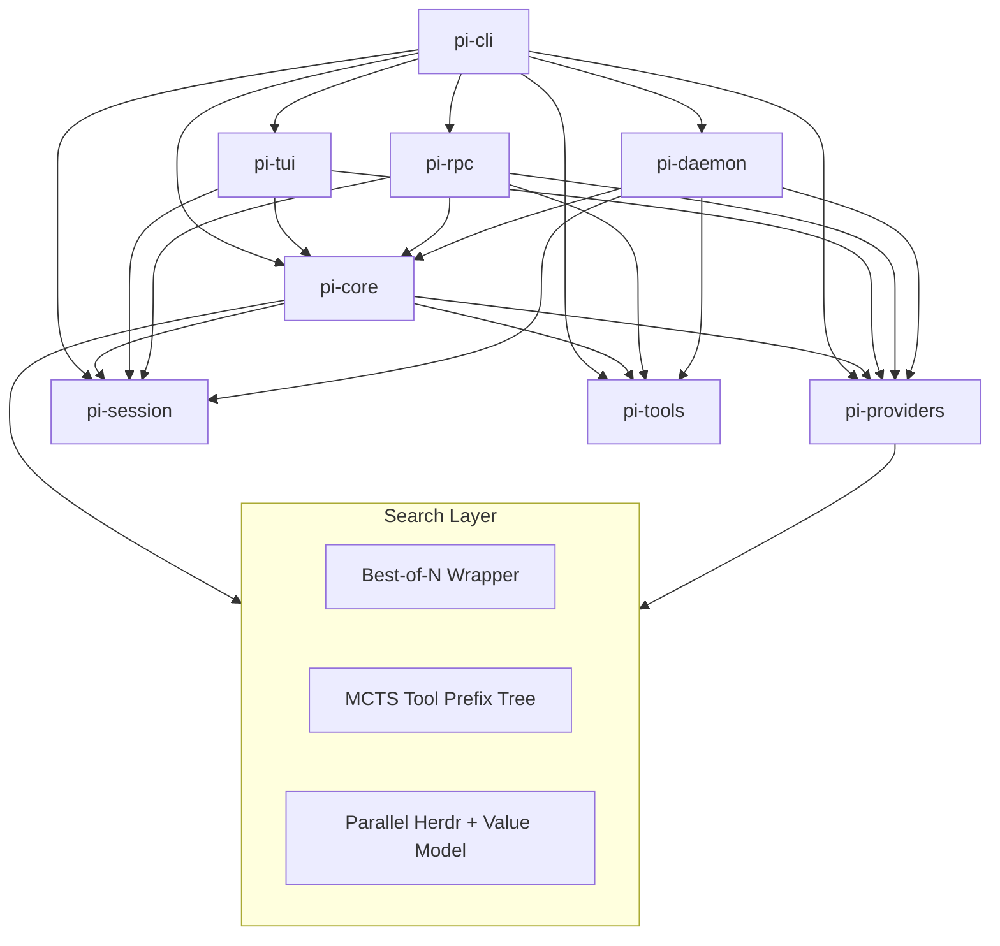

# SPEC.md — pi-rust Harness: Tree Search Layer

> Project: `pi-rust` / `tau` — universal self-improving agent harness.
> Objective: replace linear turn execution with verifiable tree search over tool trajectories.

---

## 1. Crate & Search Layer Architecture



### Dependencies
- `pi-cli` depends on all crates.
- `pi-core` depends on `pi-providers`, `pi-session`, `pi-tools`.
- `pi-daemon` depends on `pi-core`, `pi-providers`, `pi-session`, `pi-tools`.
- `pi-tui` depends on `pi-core`, `pi-providers`, `pi-session`.
- `pi-rpc` depends on `pi-core`, `pi-providers`, `pi-session`, `pi-tools`.
- Leaf crates (`pi-providers`, `pi-session`, `pi-tools`) remain decoupled.

---

## 2. Tool Contract

Tool registry lives at `crates/pi-tools/src/lib.rs:105` via `ToolExecutor::tool_definitions()`.
Dispatch lives at `crates/pi-tools/src/lib.rs:59` via `ToolExecutor::execute()`.

| Tool | Safety / Behavior |
| --- | --- |
| `read` | 1-indexed line slicing, exact boundary checks |
| `write` | atomic directory creation, overwrite allowed |
| `edit` | single-match guard, unambiguous replacement |
| `bash` | async tokio `Command`, 120s timeout, child kill on cancel |
| `grep` | recursive pattern search, `-e` flag safety |
| `find` | recursive filename/glob search |
| `ls` | directory listing with sizes |
| `web_fetch` | HTML to markdown extraction |
| `web_search` | live web search results |
| `git` | status/diff/log/worktree operations |
| `github` | PR/issue/run inspection via `gh` |
| `lsp` | diagnostics/symbols/definition/hover |
| `ast` | exact symbol/function slicing |
| `invoke_subagent` | background subagent execution |
| `manage_subagents` | lifecycle control for subagents |
| `crew_dispatch` | isolated worktree/session dispatch |
| `crew_status` | active task status query |
| `crew_merge` | completed worktree merge review |
| `speculate` | ghost-worktree race between strategies |
| `mcp` | dynamic MCP tool execution |

Dual Tool Protocol:
1. Native `tool_calls` schema when the provider supports it.
2. Markdown fallback parsing in `AgentLoop::extract_fallback_tool_calls()` for local/smaller models.

Session causality:
- Append `Assistant` with tool metadata before executing tools.
- Append `Tool` results immediately after execution.

---

## 3. Agent Loop Contract

`AgentLoop::run_turn` at `crates/pi-core/src/lib.rs:399` is the single turn entrypoint.

Current state: linear iteration over one candidate trajectory.
Target state: tree search over tool-call prefixes with verification as reward.

```
run_turn(user_input)
  -> memory recall / retrieval
  -> candidate generation
  -> search / selection
  -> verification
  -> finalize / store DAG nodes
```

Required invariants:
- Do not block JSON-RPC stdout with human-readable logs.
- Subprocess tools use async execution with timeout + kill.
- All tool mutations snapshot pre-state for `UndoEngine`.
- Alfred advises without deadlocking the agent loop.

---

## 4. Search Layer

### Tier 1 — Best-of-N
- Wrap candidate completion generation in `pi-core` and/or `pi-providers`.
- Generate `N` candidates (`best_of_n` config, default 3-5) for the same prefix.
- Selection helper ranks candidates by a cheap heuristic before execution.
- Goal: higher final-answer pass rate with minimal loop change.

### Tier 2 — MCTS over Tool Prefixes
- Replace linear turn loop with minimal MCTS on tool-call prefixes.
- Node fields: `wins`, `visits`, `uct`, `tool_prefix`, `children`.
- Phases: select -> expand -> simulate -> backprop.
- Simulate by executing the chosen tool call and returning verification reward.
- Reuse speculative worktrees where possible.
- Entry point: `crates/pi-core/src/lib.rs` in or around `run_turn`.

### Tier 3 — Parallel Herdr + Value Model
- Parallelize rollout evaluation with herdr-backed background workers.
- Add a learned or heuristic value model for node evaluation.
- Keep Tier 3 feature-gated until Tier 2 is stable.

---

## 5. Memory Recall

Before candidate search:
1. Query `TauVault` with the current user input.
2. Inject top-ranked hindsight/counter-rules into the turn prompt.
3. Use retrieved memory to bias candidate selection and tool ordering.

---

## 6. Success Criteria

| Metric | Target |
| --- | --- |
| Pass rate | workspace tests remain green after each tier |
| Cost | Best-of-N candidate increase capped by `best_of_n` config |
| Latency | Tier 1 adds bounded overhead; Tier 2 bounds rollout depth |
| Correctness | MCTS must preserve session DAG causality and metadata |
| Decoupling | leaf crates gain no orchestrator dependencies |

---

## 7. Implementation Order

1. Tier 1 Best-of-N in `pi-core` and `pi-providers`.
2. Tier 2 minimal MCTS at `AgentLoop::run_turn`.
3. Tier 3 parallel herdr + value model behind feature flags.
