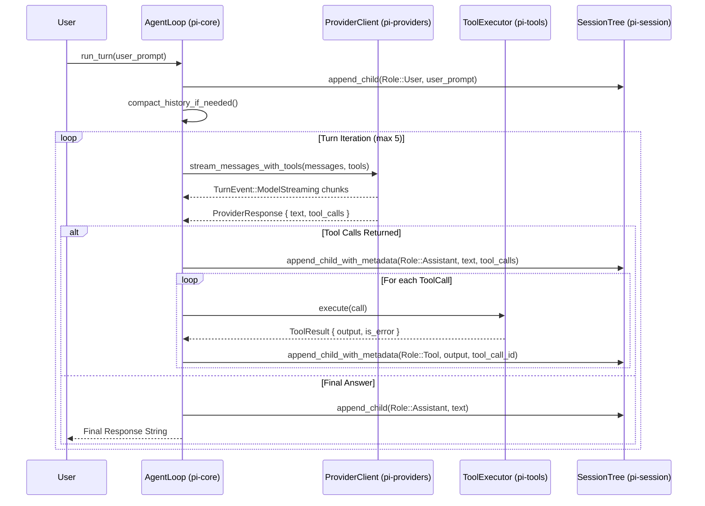

# SPEC.md — System Architecture & Protocol Specification

> **Project**: `pi-rust` (`pi-rs`) — 100% Pure Rust Port of Mario Zechner's Pi Coding Agent ([pi.dev](https://pi.dev) / [`earendil-works/pi`](https://github.com/earendil-works/pi))  
> **Core Motto**: *"100% Pure Rust — Zero Runtime Bloat, Zero Node.js, Maximum Velocity."*  
> **Design Principle**: *"Set the floor, not the ceiling."*  

---

## 1. System Architecture & Crate Graph

`pi-rust` is compiled as a self-contained Cargo workspace containing 7 focused crates. Leaf crates remain completely decoupled from orchestrator crates.

```
                                +-----------------------------------+
                                |              pi-cli               |
                                |   (Entry Binary & Dispatcher)     |
                                +-----------------+-----------------+
                                                  |
         +----------------------------------------+----------------------------------------+
         |                                        |                                        |
         v                                        v                                        v
+----------------+                       +----------------+                       +----------------+
|     pi-tui     |                       |    pi-core     |                       |     pi-rpc     |
| (Ratatui, TUI) |                       | (Agent Engine) |                       |  (JSON-RPC 2.0)|
+-------+--------+                       +---+---+----+---+                       +--------+-------+
        |                                    |   |    |                                    |
        +------------------+-----------------+   |    +------------------+-----------------+
                           |                     |                       |
                           v                     |                       v
                  +-----------------+            |              +-----------------+
                  |  pi-providers   |            |              |   pi-session    |
                  |  (Multi-LLM)    |            |              | (DAG Graph &    |
                  +-----------------+            |              |  JSONL Engine)  |
                                                 |              +-----------------+
                                                 v
                                        +-----------------+
                                        |    pi-tools     |
                                        | (Native Tools & |
                                        |  MCP Discovery) |
                                        +-----------------+
```

### Dependency Invariants
1. `pi-cli` depends on `pi-core`, `pi-providers`, `pi-session`, `pi-tools`, `pi-tui`, `pi-rpc`.
2. `pi-tui` depends on `pi-core`, `pi-providers`, `pi-session`.
3. `pi-rpc` depends on `pi-core`, `pi-providers`, `pi-session`, `pi-tools`.
4. `pi-core` depends on `pi-providers`, `pi-session`, `pi-tools`.
5. Leaf crates (`pi-providers`, `pi-session`, `pi-tools`) must remain completely decoupled from one another.

---

## 2. Upstream Pi Parity Specification

| Upstream TypeScript Package (`earendil-works/pi`) | Rust Crate (`pi-rust`) | Implementation Model & Specification |
| :--- | :--- | :--- |
| **`@earendil-works/pi-agent-core`** (`packages/agent`) | [`crates/pi-session`](file:///Users/bhavy/pi-rust/crates/pi-session) & [`crates/pi-core`](file:///Users/bhavy/pi-rust/crates/pi-core) | Directed Acyclic Graph (DAG) session tree, active branch pointer, non-destructive rewinding, and fork points. |
| **`@earendil-works/pi-ai`** (`packages/ai`) | [`crates/pi-providers`](file:///Users/bhavy/pi-rust/crates/pi-providers) | Unified multi-gateway client (Anthropic Messages API, OpenAI Chat Completions, Ollama, Kilo, OpenCode, Agnes), SSE streaming decoders, TokenProfiler, ContextBudget, AuthResolver. |
| **`@earendil-works/pi-coding-agent`** (`packages/coding-agent`) | [`crates/pi-core`](file:///Users/bhavy/pi-rust/crates/pi-core) & [`crates/pi-tools`](file:///Users/bhavy/pi-rust/crates/pi-tools) | Coding system prompt envelope, `AGENTS.md` autodiscovery, Dual Tool protocol, automated context compaction loop, built-in engineering tools (`read`, `write`, `edit`, `bash`, `grep`, `find`, `ls`, `web_fetch`, `web_search`, `git`, `github`, `lsp`, `ast`). |
| **`@earendil-works/pi-tui`** (`packages/tui`) | [`crates/pi-tui`](file:///Users/bhavy/pi-rust/crates/pi-tui) | Ratatui terminal UI, 6-stop gradient ASCII PI header, 2-line status bar, interactive overlays (Model Picker, Provider Picker, Session Tree, Auth Wizard), Mermaid ASCII/Unicode renderer, syntax-highlighted code blocks. |
| **`@earendil-works/pi-protocol`** & **`pi-server`** | [`crates/pi-rpc`](file:///Users/bhavy/pi-rust/crates/pi-rpc) | Bi-directional JSON-RPC 2.0 engine over standard I/O with ordered MPSC notification streaming (`pi/streamingChunk`, `pi/toolExecuting`, `pi/toolCompleted`). |
| **`session-backends/sqlite-node`** | [`crates/pi-session`](file:///Users/bhavy/pi-rust/crates/pi-session) | Append-only streaming `.jsonl` disk persistence matching `~/.pi/agent/sessions/--<encoded_cwd>--/<session_id>.jsonl`. |

---

## 3. Session Tree DAG & Persistence Specification

### Node Data Structure & Metadata
```rust
#[derive(Debug, Clone, Serialize, Deserialize)]
pub struct SessionNode {
    pub id: String,
    pub parent_id: Option<String>,
    pub children_ids: Vec<String>,
    pub role: Role,
    pub content: String,
    pub timestamp: String,
    pub tool_call_id: Option<String>,
    pub tool_name: Option<String>,
    pub tool_calls: Option<serde_json::Value>,
}
```

### Disk Format (`.jsonl`)
Sessions are persisted in append-only JSONL files located at:
`~/.pi/agent/sessions/--<encoded_cwd>--/<session_id>.jsonl`

**Line 1 (Session Header):**
```json
{"type":"session","version":3,"id":"<session_uuid>","timestamp":"2026-08-15T12:00:00Z","cwd":"/path/to/project"}
```

**Subsequent Lines (Messages):**
```json
{"type":"message","id":"a1b2c3d4","parentId":null,"timestamp":"2026-08-15T12:00:00Z","role":"System","content":"Session initialized"}
{"type":"message","id":"e5f6g7h8","parentId":"a1b2c3d4","timestamp":"2026-08-15T12:00:01Z","role":"User","content":"Check cargo tests"}
{"type":"message","id":"i9j0k1l2","parentId":"e5f6g7h8","timestamp":"2026-08-15T12:00:03Z","role":"Assistant","content":"","toolCalls":[{"id":"call_1","type":"function","function":{"name":"bash","arguments":"{\"command\":\"cargo test\"}"}}]}
{"type":"message","id":"m3n4o5p6","parentId":"i9j0k1l2","timestamp":"2026-08-15T12:00:05Z","role":"Tool","content":"test result: ok. 64 passed","toolCallId":"call_1","toolName":"bash"}
```

---

## 4. Multi-Turn Execution & Context Compaction Algorithm



### Context Compaction Algorithm
1. **Trigger Condition**: Total estimated conversation tokens + system tokens $\ge 0.80 \times \text{max\_context\_tokens}$.
2. **Cut-Point Discovery (`findCutPoint`)**: Traverses history up to $50\%$ depth and locates the nearest turn boundary starting with `Role::User`.
3. **Branch Summarization**: Prompts the LLM (or active model) to generate a concise summary of the older turns:
   `[Context Compaction Summary - Previous N Turns]\n<summary>\n[End Context Summary]`.
4. **DAG Re-anchoring**: Instantiates a clean compaction branch anchored by the synthetic summary system node, followed by the preserved recent turns.
5. **Event Emission**: Publishes `TurnEvent::ContextCompacted { old_turns, new_summary_len }`.

---

## 5. Dual Tool Calling Protocol

`pi-rust` guarantees universal model compatibility across frontier and local open-weights models through the **Dual Tool Protocol**:

1. **Native Structured Schema (Primary Path)**:
   - Tool definitions emitted via JSON Schema in `tools` parameter.
   - Streaming parsers extract structured tool calls from `tool_calls` deltas (OpenAI) or `content_block_start` / `input_json_delta` (Anthropic).
2. **Markdown Fallback Parsing (Secondary Path)**:
   - For models that emit markdown code blocks instead of structured tool calls, `AgentLoop::extract_fallback_tool_calls` parses fenced code blocks:
     - ```` ```write <path>\n<content>\n``` ````
     - ```` ```edit <path>\n<target>\n====\n<replacement>\n``` ````
     - ```` ```read <path> [start] [end]\n``` ````
     - ```` ```bash\n<command>\n``` ````
     - ```` ```grep "<pattern>" "<path>"\n``` ````

---

## 6. Subprocess Safety & Process Lifecycle Specification

All tool executions that invoke OS processes (`bash`, `git`, `github`, `lsp`, `mcp`) adhere to strict safety invariants:

1. **Asynchronous Execution**: Powered by `tokio::process::Command` with piped standard I/O streams.
2. **Hard Timeouts**: Execution wrapped in `tokio::time::timeout(Duration::from_secs(120), ...)`.
3. **Guaranteed Child Termination**: If execution times out or is aborted via `Esc`, `child.kill().await` and `child.wait().await` are invoked unconditionally to prevent zombie processes.
4. **Stream Separation**: Captures both stdout and stderr with structured error reporting.
5. **Parameter Escaping**: Uses `.arg(...)` arrays without shell interpolation to prevent command injection.

---

## 7. JSON-RPC 2.0 Server Specification (`--rpc`)

When launched with `--rpc`, `pi-rust` acts as a JSON-RPC 2.0 server reading newline-delimited JSON from `stdin` and writing strictly valid JSON frames to `stdout`.

### Supported RPC Methods

| Method | Parameters | Result | Description |
| :--- | :--- | :--- | :--- |
| `pi/prompt` | `{"text": "<prompt>"}` | `{"response": "<text>"}` | Executes a multi-turn prompt turn with streaming chunks. |
| `pi/models` | `{}` | `{"models": [...]}` | Lists all discovered frontier and local AI models. |
| `pi/tools/list` | `{}` | `{"tools": [...]}` | Returns tool definitions and parameter schemas. |
| `pi/tools/execute` | `{"name": "...", "arguments": {...}}` | `{"output": "...", "is_error": bool}` | Directly executes a native tool. |
| `pi/session/history` | `{}` | `{"history": [...]}` | Retrieves active branch conversation nodes. |
| `pi/session/rewind` | `{"node_id": "..."}` | `{"success": bool}` | Rewinds active branch pointer to specified node. |
| `pi/session/fork` | `{}` | `{"branch_node_id": "..."}` | Creates a new branch point. |
| `pi/mcp/list` | `{}` | `{"servers": [...]}` | Lists auto-discovered MCP servers and tools. |

### Streaming Notifications Framing
Notifications are emitted during turn execution:
- `pi/streamingChunk`: `{"jsonrpc":"2.0","method":"pi/streamingChunk","params":{"chunk":"..."}}`
- `pi/toolExecuting`: `{"jsonrpc":"2.0","method":"pi/toolExecuting","params":{"tool_name":"...","tool_call_id":"..."}}`
- `pi/toolCompleted`: `{"jsonrpc":"2.0","method":"pi/toolCompleted","params":{"tool_name":"...","is_error":bool}}`

All notifications are processed via an unbounded MPSC queue to guarantee strict FIFO delivery before the final response is flushed.
